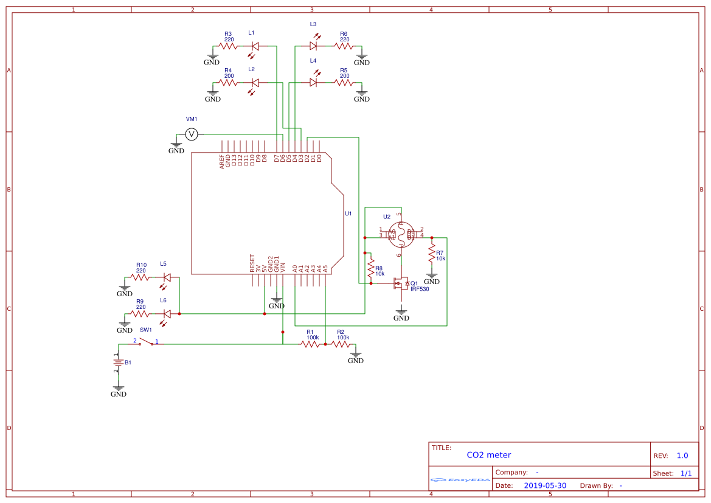

# Измеритель уровня CO2

## Особенности

* В качестве датчика используется MQ-135
* Корпус изготовлен на 3D принтере
* Для индикации используется стрелочный вольтметр

## Схема

## Список материалов

| Обозначение | Наименование             | Примечание                                  |
|-------------|--------------------------|---------------------------------------------|
| R1          | Резистор 100 кОм         |                                             |
| R2          | Резистор 100 кОм         |                                             |
| R3          | Резистор 220 Ом          |                                             |
| R4          | Резистор 220 Ом          |                                             |
| R5          | Резистор 220 Ом          |                                             |
| R6          | Резистор 220 Ом          |                                             |
| R7          | Резистор 10 кОм          |                                             |
| R8          | Резистор 10 кОм          |                                             |
| R9          | Резистор 220 Ом          |                                             |
| R10         | Резистор 220 Ом          |                                             |
| B1          | Колодка для батареи 9V   |                                             |
| SW1         | Тумблер                  |                                             |
| Q1          | MOSFET-транзистор IRF530 |                                             |
| U1          | Плата Arduino Nano       |                                             |
| U2          | Датчик MQ-135            |                                             |
| U3          | Вольтметр 82C1 - 5В      |                                             |
| L1          | Светодиод красный 5мм    | Транспарант "ПИТАНИЕ"                       |
| L2          | Светодиод красный 5мм    | Транспарант "ОПАСНЫЙ УРОВЕНЬ СО2"           |
| L3          | Светодиод красный 5мм    | Транспарант "НАГРЕВ"                        |
| L4          | Светодиод красный 5мм    | Транспарант "НИЗКИЙ УРОВЕНЬ ЗАРЯДА БАТАРЕИ" |
| L5          | Светодиод желтый 5мм     | Подсветка шкалы вольтметра                  |
| L6          | Светодиод желтый 5мм     | Подсветка шкалы вольтметра                  |
